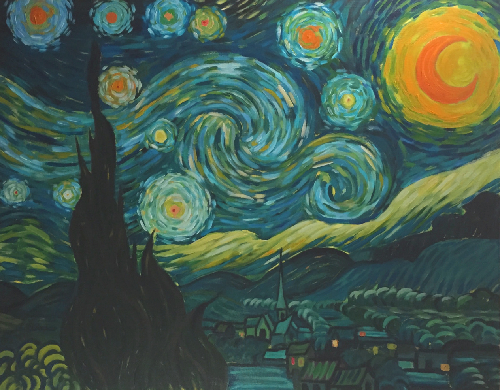

  I found it quite funny how one of the sample essays were about art. I'm an artist myself and I 
honestly can't wait to use the two (programming & art) together to its full potential when I acquire new skills from my 
Software Engineering class. Creating apps of all sorts will probably be one of my newest hobbies. However, acquiring and mastering those 
new skills will take an enormous amount of commitment and hardwork but I'm all for it! 

 

  Last week, I decided to quit my job in sales in order to focus on my studies much more. I worked about 20 hours a week last
semester and it was tough, but I was able to pull through. I suffered with bad sleeping habits, constantly got more tired, and
the stress just got worse. However, this semester will be a lot more different. I'm going to get as involved as I can in the many
clubs the campus has to offer, start working on side projects, volunteering, and most importantly studying hard. 

