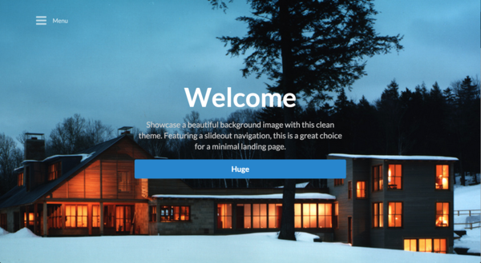

## Websites made with ease

The past week working with Semantic UI has been a blast. Upon seeing websites made using it
I was honestly in love. The design was simple, slick, and modern. In comparison to raw HTML
and CSS it was pretty obvious that Semantic UI saves its users so much time. 

## Just type what you want!

* Did you need to make a list? Type in *class="ui list"*
* What about a button? Type in *class="ui button"*
* Did you want that button to be red? You guessed right, *class="ui red button"*

The code is predictable.. which in my opinion is **immensely** helpful! Once you start getting
the hang of how to manipulate the Semantic UI elements, modules, and such, you'll find yourself
discovering out different widgets that you've yet searched for in their library. The possibilities
were literally endless, as you can keep tacking on different attributes to whatever you wanted; an 
amazing achievement from them.

## Final thoughts

Before I say anything else can we agree that their [website](http://semantic-ui.com/) is fucking amazing?! 
Honestly though, if their site looked like shit, I don't think Semantic UI would've be fun to learn. 
The way it looks makes you feel happy, calm, **AND** you don't feel overwhelmed even though there is a ton of content.
I think I went through every possible link just to appreciate the site's design.

Overall, learning Semantic UI was straightforward and easy. Recreating existing sites using it,
inspired me and gave me ideas for my own websites. When I finish one, I'll be sure to share it here!

