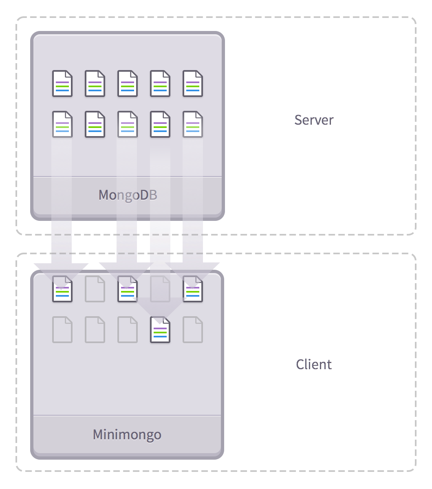

## Meteor is magic

I recently created two web applications: One using JEE and the other using Meteor. 

The JEE web app required me to juggle __SQL__, the __Oracle DB__, __GlassFish__, getting the connection to the DB to work, and getting data from the DB to the web application and vice versa.

Meteor on the other hand already had the whole package. All I had to do to start my app was to just run 'meteor run' 
in my app's directory and at the same time it also:

1.  Starts up your Web Server
2.  Automatically watches all of your app's files
3.  Auto-refreshes your browser upon seeing a change

I am confident that if I were to recreate my JEE web app in Meteor, the difference in the amount of code would probably be in the hundreds. Just like UI frameworks, Meteor is an outstanding time-saver. If only I knew about Meteor sooner. What took me ~2 hours to set up on the JEE web app only took me ~5 minutes to set-up on Meteor. 
This is __sorcery__.

## Saved me time but not my mind

I am not going to lie. When I was first introduced to Meteor I felt like I was looking at ancient hieroglyphics. The different method calls, imports, library methods, and odd parameters threw me in for one hell of a headache. This lasted for days. I believe the problem was that I was spending too much time looking at the code as a whole rather than looking at it line by line. During the first week, I tried my best to follow what the tutorials were saying but it just wasn't clicking for me yet.

However, as soon as I started working on more tutorials, seeing other people build apps from scratch, and building off of Meteor's sample templates, I slowly began to understand how some of the things were being pieced together.

Meteor works on a __publish__ and __subscribe__ system. Put simply, when you publish you're controlling what data is available to the app's users through MongoDB. When you subscribe you are mirroring parts of that data you published to the specific client thorugh MinimongoDB. Also, if data is updated on the client side then it also updates on the server as well as other affected clients which have access to that specific type of data.

## Final Thoughts

So I guess you can say my experience learning Meteor wasn't that bad. You're never really comfortable with something you've only been doing for two weeks out anyways. Learning Meteor to its full potential reaps huge rewards, so I'll be patient and keep at it. 

