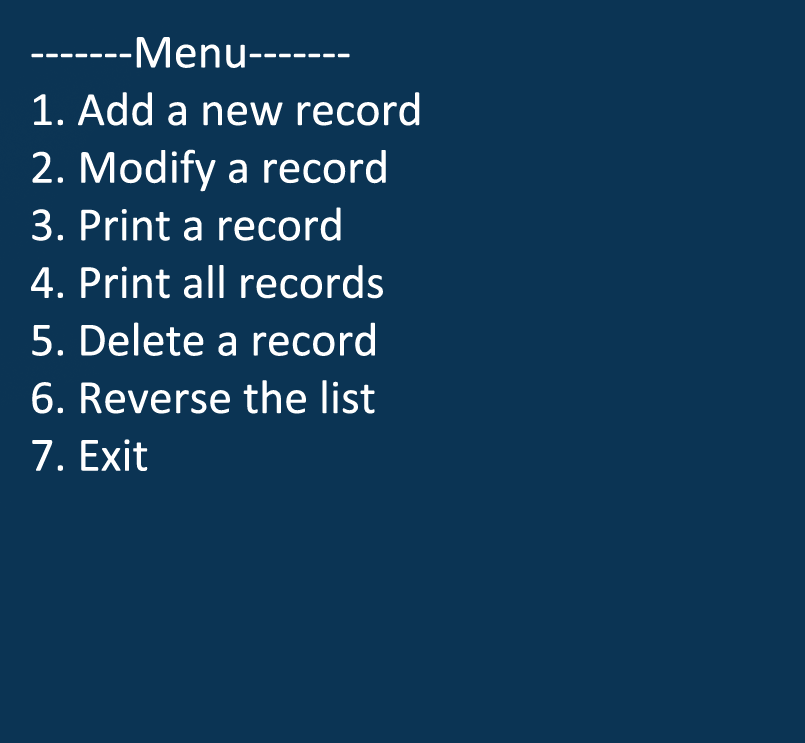

Here is the [Project Link](https://github.com/gviloria/gviloria.github.io/tree/master/projects/Project_3)

This project pretty much has the same functionality as Project 1 except this is an implementation of it in C++.
For this project I added another choice which allows the user to reverse the list.

If the choice is 

1. Add a record
2. Modify a record and allow the user to change the NAME,
3. Prints a record and prints all duplicates with same account number
4. Prints all records, 
5. Deletes a record, 
6. Reverses the list 
7. Exits the loop and thus ending the program. 

Afterwards, the program will write all records to file and will clear all of the allocated memory (if any).
        
If debug mode is invoked, it will display the function name,it's parameters, and what it received.
If debug mode is invoked, the functions information will be printed.

