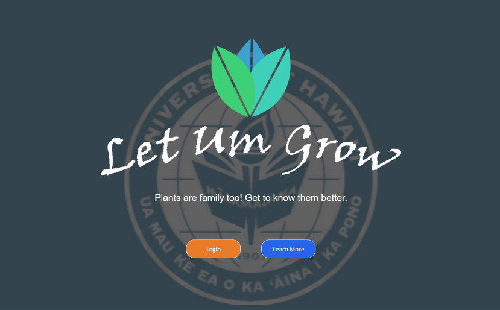

[Our project page](https://letumgrow.github.io/)

I am part of an organization that made a web application for our University called LetUmGrow.

LetUmGrow is a social network for plants located on the UH Manoa Campus.

Looking for a specific plant or want to learn more about a plant that you've seen? Our interactive map displays the location of nearby plants and links to each plant profile.

Spotted a new plant on campus? Create a profile page for that plant and add updates to its feed, like pictures or statuses. Keep track of plants in your garden or view what plants are on your favorite hike with LetUmGrow. Who knows, there might even be a reward waiting for you if you do!

