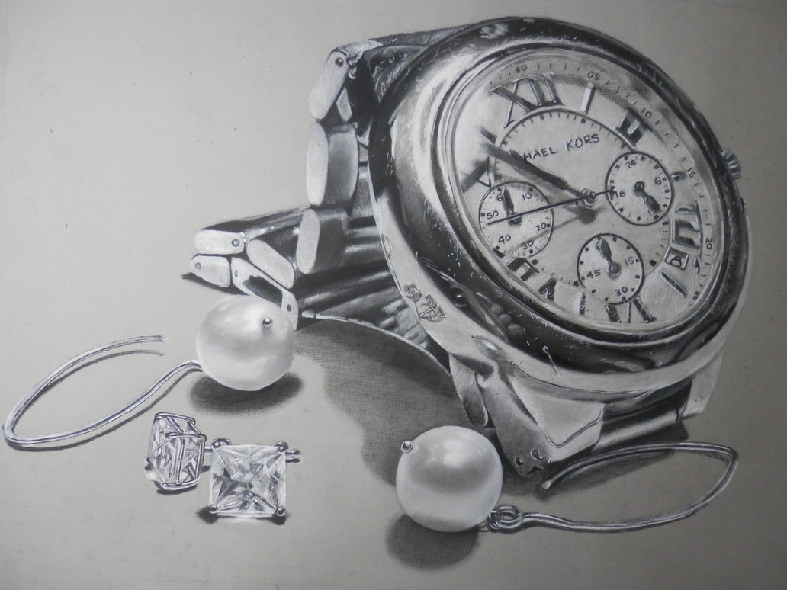
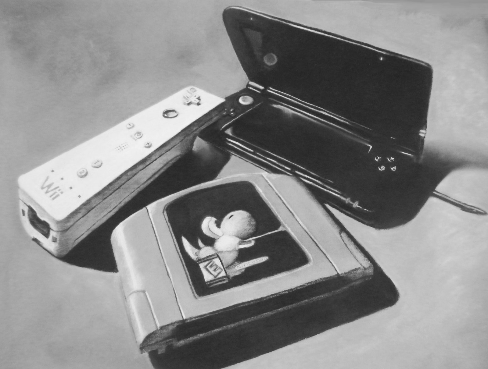

I've always had an interest for Art since I was a child. My dad was the one who inspired me to get into art because he'd always show me 
his drawings back when he was still in college as an architectural student. 
I wanted to do the same! Soon after, I began creating art whenever I got the chance to. 
I always loved and still love sharing my art with my friends and family.

Through art, my love for programming also sparked. I've always appreciated and enjoyed the art design from all the video games I've played
throughout the years. And at one point I got so inspired, that I wanted to learn how the programmers pieced together my favorite video games. I wanted to learn the process of coding in hopes to make my own game or application to share with others just like I have been with my art. Which is why I'm studying CS!

What amazes me is that with art and programming, you can build something absolutely beautiful and amazing...almost out of nothing! My creativity can run wild through both.

Anyways, I hope you enjoy my art!

My art gallery can be found [here](http://xiloria.deviantart.com/)
