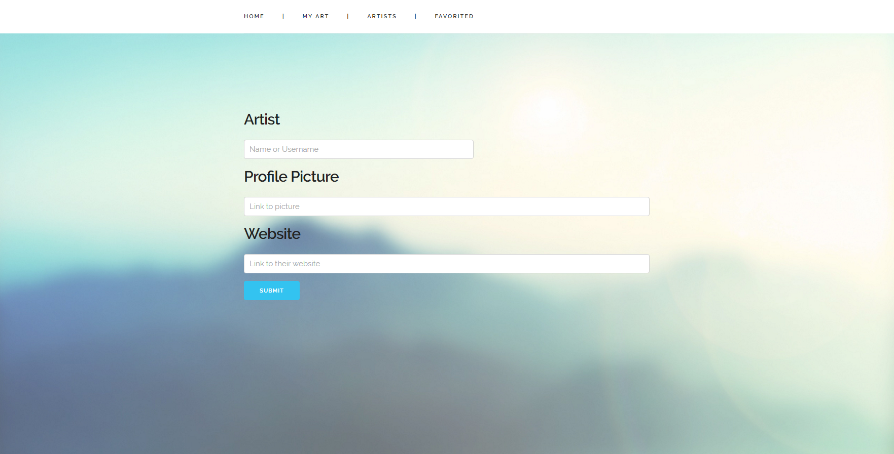

[Project Link](https://github.com/gviloria/art.companion)

Art.Companion is web application I created for artists to keep track of their own artwork, their favorite artists and their artwork,
as well as artwork online. It is PHP based and uses PHP, HTML, and Javascript.

This was made at the end of my FALL 2016 semester. I decided I wanted to use my newly gained knowledge from Software Engineering and Database Management.

If you have any questions regarding the web application, feel free to send me an email!

Here are screenshots of my web application:

## Landing Page

## My Art Gallery Page

## Manage My Art Page

## Add to My Art Page

## Favorite Artists Page

## Manage Favorite Artists Page

## Add Favorite Artist Page

## Favorite Art Page

## Manage Favorite Art Page

## Add Favorite Art Page

